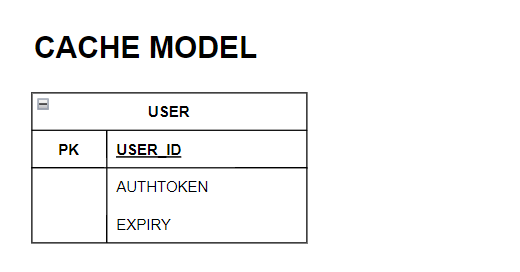

# Password Manager

## High Level Diagram

- **Frontend and API service:** acts as a loadbalancer to access the individual component.
- **UI:** it is the GUI of the password manager.
- **API:** it is the API of the password manager.
- **SQL DB** it is the Datastore of the password manager

## Database Model

1) User : Stores User's login data 
2) Credentials : Stores Credentials in encrypted form

## Cache Model

The user's authToken and expiry will be stored in the redis cache in the form of a hashmap, the userId being the key to the hasmap.

