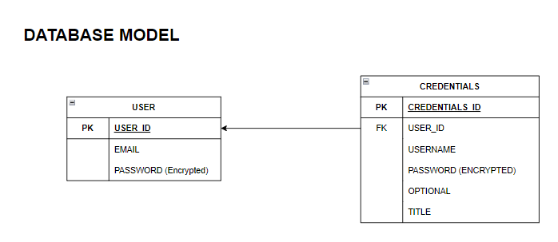

# Password Manager

## High Level Diagram

- **Frontend and API service:** acts as a loadbalancer to access the individual component.
- **UI:** it is the GUI of the password manager.
- **API:** it is the API of the password manager.
- **SQL DB** it is the Datastore of the password manager

## Database Model

1) User : Stores User's login data 
2) Credentials : Stores Credentials in encrypted form

## Cache Model

- The user's authToken and expiry will be stored in the redis cache in the form of a hashmap, the userId being the key to the hasmap. 
- Once a user's authToken is expired and user logs in the value of the hashmap gets updated with new authToken and expiry. 
- If the user logs out, that entry is deleted from the hashmap

## Running the password-manager
1) Add the secret files (db_developer_password.txt, db_root_password.txt) in /api/secrets folders

2) Run `docker compose up` in PasswordManager directory

3) Run the following curl to ensure service is up and running
`curl --location http://127.0.0.1:8080/health`

