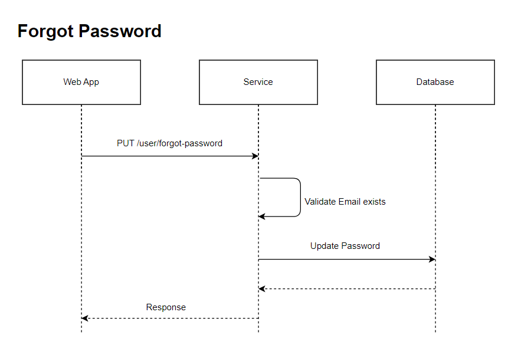

# Forgot Password LLD/API Contract

## Description
This api is used to change the password of the user in case user forgets the password.

## LLD



## Request

### Path
| **Field** | **Value**                             |
|-----------|-----------                            |
| Base Url  | http://localhost:8080/password-manager|
| Path      |    /user/password/set                 |
| Headers   | Content-Type: application/json        |

### Request Body
| **Field** | **Description**             | **Valid Values**                                                                 |
|-----------|-----------------------------|----------------------------------------------------------------------------------|
| userId    | userId assigned to user     | any UUID                                                                         |
| email     | username used to login      | valid email                                                                      |
| password  | password to be set          | Contains lowercase, uppercase, special character, digits and minimum length of 8 |


### Sample Request
```
curl --location 'http://localhost:8080/password-manager/user/password/set' \
--header 'Content-Type: application/json' \
--data '{
    "userId" : "e27d273a-8f9b-11ee-b9d1-0242ac120002",
    "email" : "email@gmail.com",
    "password" : "abc123@Abc"
}'
```

## Response

### Response Body
| **Field**          | **Description**                          |
|--------------------|------------------------------------------|
| status             | status of password set - SUCCESS/FAILED  |
| error.Code         |                                          |
| error.Description  |                                          |

### Sample Response
```
{
    "status" : "SUCCESS"/"FAILIURE",
    "error" : {
        "code" : "",
        "description" : ""
    }
}
```


