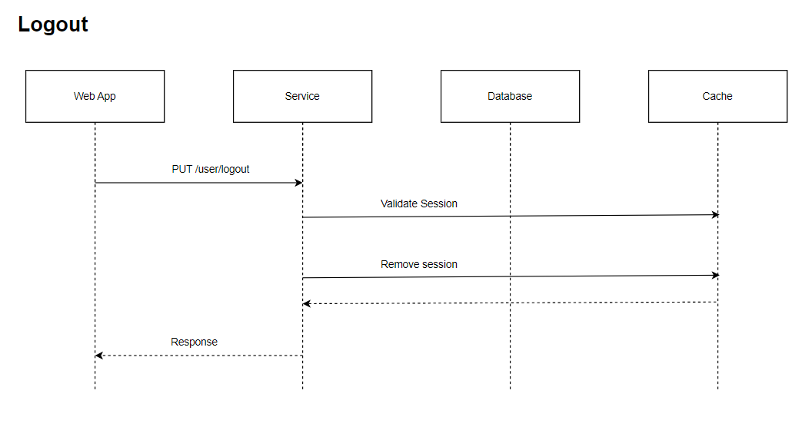

# Logout LLD/API Contract

## Description
The logout api is used to logout the user in the password manager.

## LLD



## Request

### Path
| **Field** | **Value**                             |
|-----------|-----------                            |
| Base Url  | http://localhost:8080/password-manager|
| Path      |    /user/logout                       |
| Headers   | Content-Type: application/json        |
| Headers   |Authorization: Bearer aksjfkfjd        |


### Request Body
| **Field**  | **Description**                             | **Valid Values**                                                                 |
|------------|---------------------------------------------|----------------------------------------------------------------------------------|
| userId     | userId assigned by password manager         |                                                                                  |


### Sample Request
```
curl --location --request PUT 'http://localhost:8080/password-manager/user/logout' \
--header 'Content-Type: application/json' \
--header 'Authorization: Basic dkfjlkdsjflksdjl' \
--data '{
    "userId" : "e27d273a-8f9b-11ee-b9d1-0242ac120002"
}'
```

## Response

### Response Body
| **Field**          | **Description**                    |
|--------------------|------------------------------------|
| status             | status of login  - SUCCESS/FAILED  |
| userId             |    user's Id assigned by service   |
| error.Code         |                                    |
| error.Description  |                                    |

### Sample Response
```
{
    "status" : "SUCCESS"/"FAILIURE",
    "userId" : "e27d273a-8f9b-11ee-b9d1-0242ac120002",
    "error" : {
        "code" : "",
        "description" : ""
    }
}
```


