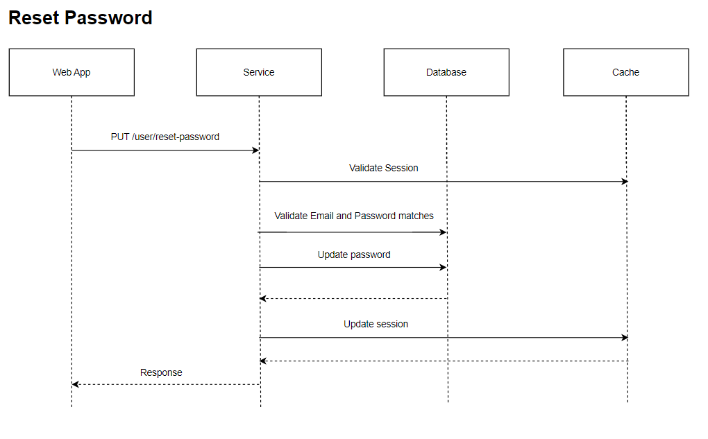

# Reset Password LLD/API Contract

## Description
This api is used to change the password of the user.

## LLD



## Request

### Path
| **Field** | **Value**                               |
|-----------|-----------                              |
| Base Url  | http://localhost:8080/password-manager  |
| Path      |    /user/reset-password                 |
| Headers   | Content-Type: application/json          |

### Request Body
| **Field**    | **Description**             | **Valid Values**                                                                 |
|--------------|-----------------------------|----------------------------------------------------------------------------------|
| userId       | userId assigned to user     | any UUID                                                                         |
| email        | username used to login      | valid email                                                                      |
| authToken    | latest authToken            |                                                                                  |
| oldPassword  | current password            | Contains lowercase, uppercase, special character, digits and minimum length of 8 |
| newPassword  | password to be set          | Contains lowercase, uppercase, special character, digits and minimum length of 8 |


### Sample Request
```
curl --location 'http://localhost:8080/password-manager/user/reset-password' \
--header 'Content-Type: application/json' \
--data '{
    "userId" : "e27d273a-8f9b-11ee-b9d1-0242ac120002",
    "email" : "email@gmail.com",
    "authToken" : "asdfoiwjoiejfakjskaj1231fkjsksdjf",
    "oldPassword" : "abc123@Abc",
    "newPassword" : "abc123@Abc"
}'
```

## Response

### Response Body
| **Field**          | **Description**                            |
|--------------------|------------------------------------------  |
| status             | status of password reset - SUCCESS/FAILED  |
| userId             |    user's Id assigned by service           |
| authToken          |    used to authorize calls                 |
| error.Code         |                                            |
| error.Description  |                                            |

### Sample Response
```
{
    "status" : "SUCCESS"/"FAILIURE",
    "userId" : "e27d273a-8f9b-11ee-b9d1-0242ac120002",
    "authToken" : "oyupytoiuotpyjfakjskaj1231fkjsksdjf",
    "error" : {
        "code" : "",
        "description" : ""
    }
}
```


