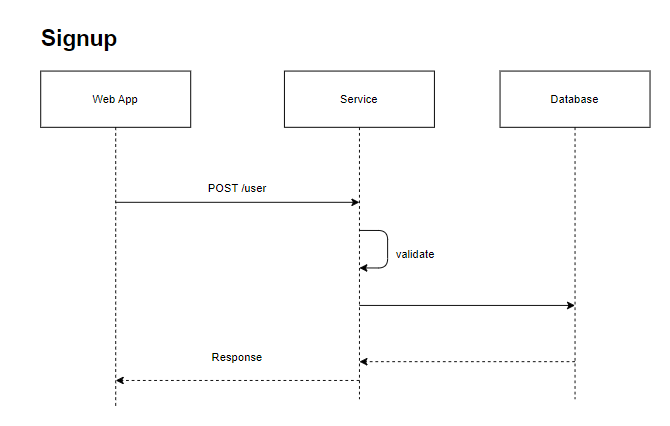

# Signup LLD/API Contract

## Description
The signup api is used to create an account for the user in the password manager.

## LLD



## Request

### Path
| **Field** | **Value**                             |
|-----------|-----------                            |
| Base Url  | http://localhost:8080/password-manager|
| Path      |    /user                              |
| Headers   | Content-Type: application/json        |

### Request Body
| **Field** | **Description**             | **Valid Values**                                                                 |
|-----------|-----------------------------|----------------------------------------------------------------------------------|
| email     | username for user to login  | valid email                                                                      |
| password  | password for user to login  | Contains lowercase, uppercase, special character, digits and minimum length of 8 |


### Sample Request
```
curl --location 'http://localhost:8080/password-manager/user' \
--header 'Content-Type: application/json' \
--data '{
    "email" : "email@gmail.com",
    "password" : "abc123@Abc"
}'
```

## Response

### Response Body
| **Field**          | **Description**                    |
|--------------------|------------------------------------|
| status             | status of signup - SUCCESS/FAILED  |
| error.Code         |                                    |
| error.Description  |                                    |

### Sample Response
```
{
    "status" : "SUCCESS"/"FAILIURE",
    "error" : {
        "code" : "",
        "description" : ""
    }
}
```


